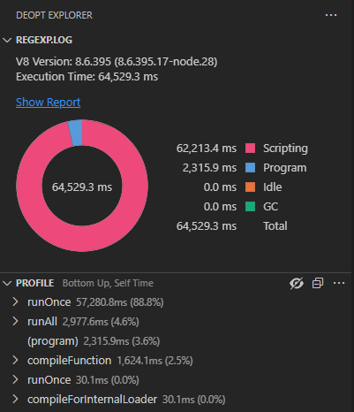
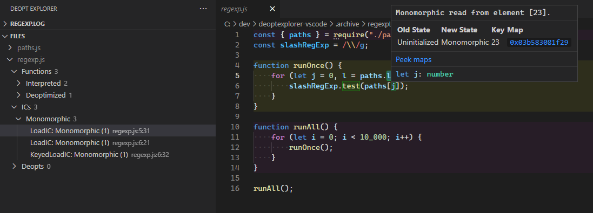
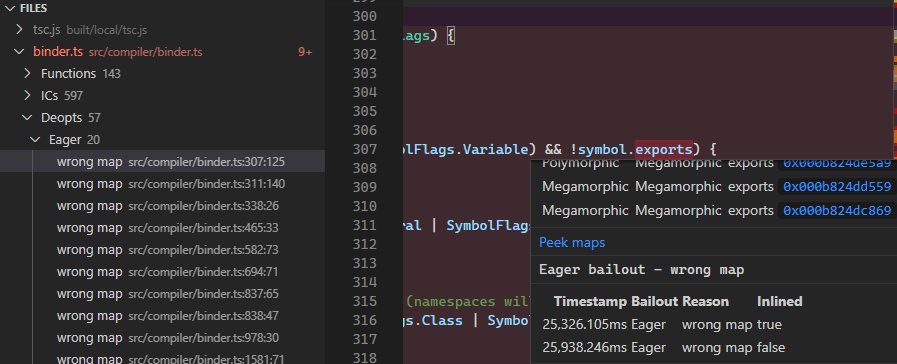
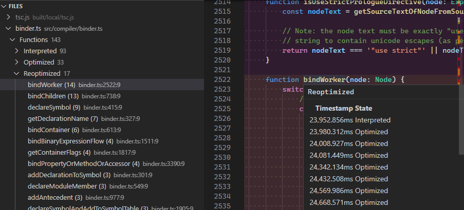
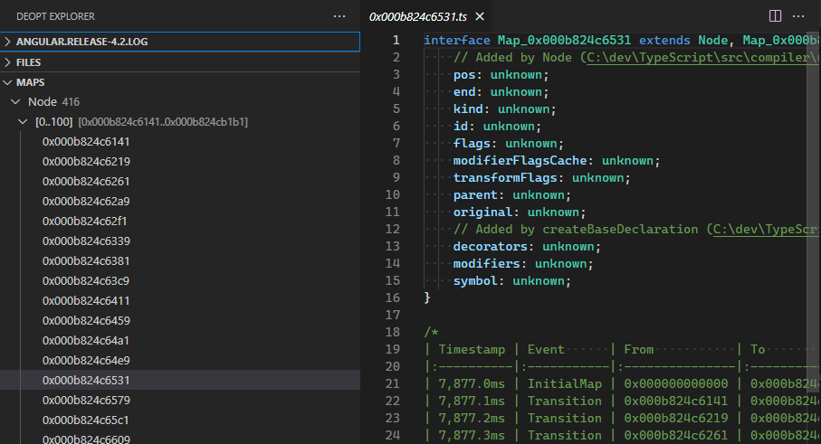
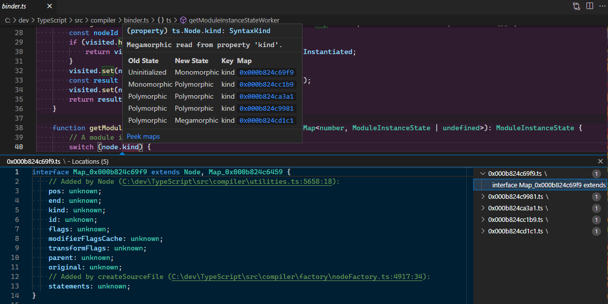

# deoptexplorer-vscode

A VS Code extension to inspect deoptimizations, ICs, function states, V8 maps, and cpu profiling data for your
JavaScript and TypeScript code running in V8 (i.e., Edge, Chrome, NodeJS, etc.).

## Overview

Deopt Explorer is a tool for visualizing V8 trace log information in VS Code. This can give you insight into the inner
workings of V8's optimizing compiler that can be used to analyze your code to look for possible causes for performance
regressions. This tool is primarily designed for advanced users who have an understanding of V8's internals. It does not
provide recommendations for performance improvements, but does give you access to information that you can use to make
informed decisions about the performance of your code.

The information provided by Deopt Explorer can be broken down into several categories:

- [CPU Profiles](#cpu-profiles) &mdash; Provides a tree view to view CPU profiling information.
- [Inline Cache evolution](#inline-cache-evolution) &mdash; Inspect how an [Inline Cache][] evolves during execution.
- [Deoptimizations](#deoptimizations) &mdash; View the kinds of deoptimizations that occured in a function.
- [Function State](#function-state) &mdash; View whether a function was interpreted or compiled.
- [Maps](#maps) &mdash; View the types of each object encountered by V8.

### CPU Profiles

Deopt Explorer can read trace file output from the `--prof` command line option to provide a tree view that allows you
to view *Top Down* (Call Tree), *Bottom Up*, and Flat views, similar to the Chrome Dev Tools:



### Inline Cache Evolution

Using the `ICS` tree view, you can navigate IC events and used editor decorations and hover information to inspect how
an [Inline Cache][] (IC) evolves based on the types of values encountered by V8's interpreter and optimizing compiler:



### Deoptimizations

Deopt Explorer provides information on when V8's optimizing compiler switches back to the interpreter to collect type
feedback that is used to patch a function when different types are encountered:



### Function State

Deopt Explorer provides information on the state of a JavaScript function, such as whether a function was executed
enough times to be optimized by the optimizing compiler, rather than being run purely in the interpreter:



### Maps

V8 keeps track of the layout of objects in memory in what is known as a "Map" (not to be confused with the JavaScript
`Map` object). This extension allows you to view the various Maps encountered by an Inline Cache, and trace each
property in a Map back to the function that assigned it. This can allow you to investigate and reduce unnecessary
polymorphism in your code:



You can also peek at the maps associated with an [IC](#inline-caches) event:



## How to Use

Deopt Explorer gathers deoptimizations from a V8 log file you can generate from the command line. The easiest
way to generate a log compatible with your current NodeJS install is to use [`dexnode`](#dexnode).

### `dexnode`

[`dexnode`](https://npmjs.com/package/dexnode) is a commandline utility published on NPM. It wraps the existing `node`
executable to provide the commandline options necessary to generate a v8 log that can be consumed by Deopt Explorer.

#### Installation

```sh
npm install --global dexnode
```

#### Examples

```sh
# NodeJS (via global install)
dexnode myscript.js

# NodeJS (via `npm exec`)
npm exec dexnode myscript.js

# Deno (via `deno run`)
deno run -A npm:dexnode myscript.js
```

#### Usage

```
dexnode [options] [--] <executable> [executable_options]
options:
  -h --help        print this message
     --no-maps     exclude v8 maps from log
     --no-ics      exclude ics from log
     --no-deopts   exclude deopts from log
     --no-profile  exclude cpu profile from log
     --no-sources  exclude sources from log
     --no-quiet    write dexnode messages to stdout (default)
     --maps        include v8 maps in log (default)
     --ics         include ics in log (default)
     --deopts      include deopts in log (default)
     --profile     include cpu profile in log (default)
     --sources     include sources in log (default)
     --quiet       do not write dexnode messages to stdout
     --out FILE    write all log output to FILE (default: isolate-<pid>-<isolate id>-v8.log)
     --            pass all remaining arguments to node
```

### NodeJS Commandline Options

You can also pass the requisite commandline options directly to the `node` process. Since V8 is constantly evolving, the
exact command line switches depend on the version of V8, NodeJS, etc. Running with the requisite switches will create an
`isolate-<id>-v8.log` file in the current directory that can be consumed by Deopt Explorer.

#### NodeJS 16+

```sh
node \
  --prof \
  --log-deopt \
  --log-ic \
  --log-maps \
  --log-maps-details \
  --log-internal-timer-events \
  --log-code \
  --log-source-code \
  --detailed-line-info \
  path/to/file.js
```

#### NodeJS 12.x, 14.x

```sh
node \
  --prof \
  --trace-ic \
  --trace-maps \
  --trace-maps-details \
  --log-internal-timer-events \
  --log-code \
  --log-source-code \
  --detailed-line-info \
  path/to/file.js
```

#### Options Overview

The options provided above have the following effects on the output log file, which are leveraged by Deopt Explorer:

- `--prof` &mdash; Writes statistical profiling information to the log (implies `--log-code`, see below).
    - Deopt Explorer uses the profiling information to generate a navigable CPU profile and to generate graphs that
      indicate where time is spent during execution.
- `--log-deopt` &mdash; Writes code deoptimization events to the log.
    - Deopt Explorer uses this information to track and provide explanations for deoptimizations that happen during
      execution.
- `--log-ic`/`--trace-ic` &mdash; Writes inline cache (IC) state transitions to the log.
    - Deopt Explorer uses this information to track and provide explanations for the various optimizations and
      deoptimizations that happen during execution, such as when a function transitions from being "monomorphic" to
      becoming "polymorphic" due to differing inputs.
- `--log-maps`/`--trace-maps` &mdash; Writes information about v8 "maps" (the internal representation of a JavaScript
  Object's structure and properties) to the log.
    - Deopt Explorer uses this to provide detailed information about the various "maps" v8 encounters to help isolate
      differences in object shape that might cause inline cache misses
      and trigger recompilation
- `--log-maps-details`/`--trace-maps-details` &mdash; Writes additional details about v8 "maps" to the log.
    - Deopt Explorer provides this additional information when viewing a map.
- `--log-internal-timer-events` &mdash; Writes internal V8 timer events to the log file.
    - Deopt Explorer uses these events to generate graphs that indicate wheere time is spent during execution.
- `--log-code` &mdash; Writes code events to the log file (automatically set if `--prof` is provided).
    - Deopt Explorer uses this information to track function addresses and deoptimization bailouts.
- `--log-source-code` &mdash; Writes the script ID, URL (or path), and source text for each script evaluated by V8.
    - Deopt Explorer uses this information to get accurate line/column mappings for sources, and makes the log file
      portable to other machines for analysis.
    - NOTE: This setting is *optional*. Deopt Explorer will attempt to resolve the source code from the file system for
      the scripts it encounters.
- `--detailed-line-info` &mdash; Writes detailed line information to the log file for use with CPU profiling.
    - Deopt Explorer uses this information to get accurate line/column mappings.

> NOTE: Some flags are not supported in all versions of v8/NodeJS. You may omit flags that are not available and Deopt
> Explorer will still work, though with reduced functionality.

In addition, you can customize the log file name and location using the following options:

- `--logfile="path/to/file.log"` - Sets the name of the output log file. If log files are generated per isolate (the
  default), an `isolate-<id>-` prefix will be prepended to the file name.
- `--no-logfile-per-isolate` - Disables generation of a separate log file per isolate.

From within VS Code, execute the `Deopt Explorer: Open V8 Log` command. This will add highlighting for various
optimization hints in the related source code files:

- Highlighting and diagnostics for Eager, Lazy, Soft, and Debugger deoptimizations.
- Highlighting for IC hints, such as polymorphic and megamorphic property access.
- Highlighting for Optimization state for functions.

### Chromium (Chrome, MS Edge) Commandline Options

To use Deopt Explorer with Chrome, Edge, or other Chromium based browsers, you must specify the `--no-sandbox`
commandline option and encode the same V8 options from [Options Overview](#options-overview) as a comma-separated list
passed via the `--js-flags` option. For example:

```
chrome \
  --no-sandbox \
  --js-flags=--log-deopt,--log-ic,--log-maps,--log-maps-details,--log-internal-timer-events,--prof,... <URL>
```

It may be necessary to ensure all existing browser processes are closed before launching the browser. On Android, it may
also be necessary to specify the `--single-process` option due to Android's sandboxing rules:

```
chrome \
  --no-sandbox \
  --single-process \
  --js-flags=--log-deopt,--log-ic,--log-maps,--log-maps-details,--log-internal-timer-events,--prof,... <URL>
```

## Caveats

V8 changes frequently in ways that can break this tool. While I try to keep this up to date with engine releases, and
support multiple versions of the engine, it can be difficult for one person to keep on top of breaking changes. If you
find the extension is not working for you and you are using a more recent version of NodeJS or the V8 engine, please
file an issue. Log parsing failures should show up in the Output Window for the "Deopt Explorer" extension.

<!--
## Color Customization

The following color customizations can be configured in your VS Code user or workspace settings under the `"workbench.colorCustomizations"` section:

- `deoptexplorer.uninitializedIc.background` - Background color for 'Uninitialized' V8 ICs
- `deoptexplorer.uninitializedIc.border` - Border color for 'Uninitialized' V8 ICs
- `deoptexplorer.uninitializedIc.overviewRuler` - Overview ruler color for 'Uninitialized' V8 ICs
- `deoptexplorer.premonomorphicIc.background` - Background color for 'Premonomorphic' V8 ICs
- `deoptexplorer.premonomorphicIc.border` - Border color for 'Premonomorphic' V8 ICs
- `deoptexplorer.premonomorphicIc.overviewRuler` - Overview ruler color for 'Premonomorphic' V8 ICs
- `deoptexplorer.monomorphicIc.background` - Background color for 'Monomorphic' V8 ICs
- `deoptexplorer.monomorphicIc.border` - Border color for 'Monomorphic' V8 ICs
- `deoptexplorer.monomorphicIc.overviewRuler` - Overview ruler color for 'Monomorphic' V8 ICs
- `deoptexplorer.polymorphicIc.background` - Background color for 'Polymorphic' V8 ICs
- `deoptexplorer.polymorphicIc.border` - Border color for 'Polymorphic' V8 ICs
- `deoptexplorer.polymorphicIc.overviewRuler` - Overview ruler color for 'Polymorphic' V8 ICs
- `deoptexplorer.recomputeHandlerIc.background` - Background color for 'Recompute Handler' V8 ICs
- `deoptexplorer.recomputeHandlerIc.border` - Border color for 'Recompute Handler' V8 ICs
- `deoptexplorer.recomputeHandlerIc.overviewRuler` - Overview ruler color for 'Recompute Handler' V8 ICs
- `deoptexplorer.megamorphicIc.background` - Background color for 'Megamorphic' V8 ICs
- `deoptexplorer.megamorphicIc.border` - Border color for 'Megamorphic' V8 ICs
- `deoptexplorer.megamorphicIc.overviewRuler` - Overview ruler color for 'Megamorphic' V8 ICs
- `deoptexplorer.genericIc.background` - Background color for 'Generic' V8 ICs
- `deoptexplorer.genericIc.border` - Border color for 'Generic' V8 ICs
- `deoptexplorer.genericIc.overviewRuler` - Overview ruler color for 'Generic' V8 ICs
- `deoptexplorer.softDeopt.background` - Background color for 'Soft' V8 Deoptimizations
- `deoptexplorer.softDeopt.border` - Border color for 'Soft' V8 Deoptimizations
- `deoptexplorer.softDeopt.overviewRuler` - Overview ruler color for 'Soft' V8 Deoptimizations
- `deoptexplorer.lazyDeopt.background` - Background color for 'Lazy' V8 Deoptimizations
- `deoptexplorer.lazyDeopt.border` - Border color for 'Lazy' V8 Deoptimizations
- `deoptexplorer.lazyDeopt.overviewRuler` - Overview ruler color for 'Lazy' V8 Deoptimizations
- `deoptexplorer.eagerDeopt.background` - Background color for 'Eager' V8 Deoptimizations
- `deoptexplorer.eagerDeopt.border` - Border color for 'Eager' V8 Deoptimizations
- `deoptexplorer.eagerDeopt.overviewRuler` - Overview ruler color for 'Eager' V8 Deoptimizations
- `deoptexplorer.compiledCode.background` - Background color for 'Compiled' V8 Code entries
- `deoptexplorer.compiledCode.overviewRuler` - Overview ruler color for 'Compiled' V8 Code entries
- `deoptexplorer.optimizableCode.background` - Background color for 'Optimizable' (ie. 'Interpreted') V8 Code entries
- `deoptexplorer.optimizableCode.overviewRuler` - Overview ruler color for 'Optimizable' (ie. 'Interpreted') V8 Code entries
- `deoptexplorer.optimizedCode.background` - Background color for 'Optimized' V8 Code entries
- `deoptexplorer.optimizedCode.overviewRuler` - Overview ruler color for 'Optimized' V8 Code entries
-->

<!--
## Release Notes

Users appreciate release notes as you update your extension.

### 1.0.0

Initial release of ...

### 1.0.1

Fixed issue #.

### 1.1.0

Added features X, Y, and Z.
-->

# License

Deopt Explorer is free and open-source software and is licensed under the [MIT License](LICENSE).

## Third Party Licenses

Deopt Explorer was made possible by building on the works of other talented engineers. You can find more information
about the licenses for these projects in [THIRD_PARTY_LICENSES](THIRD_PARTY_LICENSES). This includes:

- V8 ([LICENSE.v8](LICENSE.v8))
- Chromium ([LICENSE.chromium](LICENSE.chromium))
- Visual Studio Code ([LICENSE.vscode](LICENSE.vscode))
- Deoptigate ([LICENSE.deoptigate](LICENSE.deoptigate)), by Thorsten Lorenz (@thlorenz).

## Trademarks

This project may contain trademarks or logos for projects, products, or services. Authorized use of Microsoft trademarks
or logos is subject to and must follow [Microsoft’s Trademark & Brand Guidelines][Trademark]. Use of Microsoft
trademarks or logos in modified versions of this project must not cause confusion or imply Microsoft sponsorship. Any
use of third-party trademarks or logos are subject to those third-party’s policies.

[Inline Cache]: https://en.wikipedia.org/wiki/Inline_caching
[Trademark]: https://www.microsoft.com/en-us/legal/intellectualproperty/trademarks/usage/general